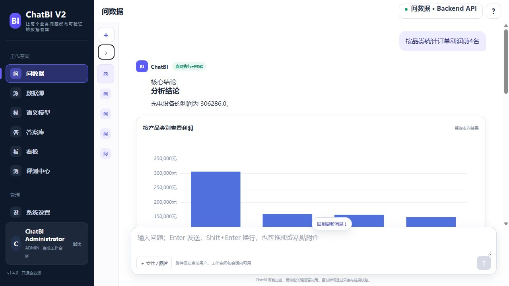
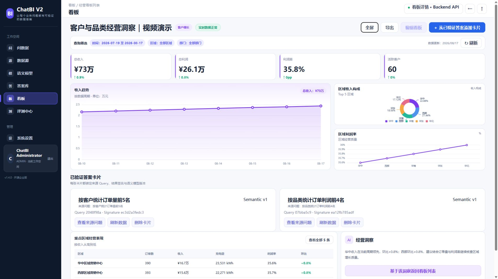
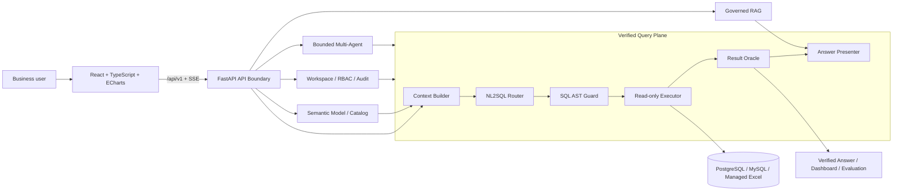
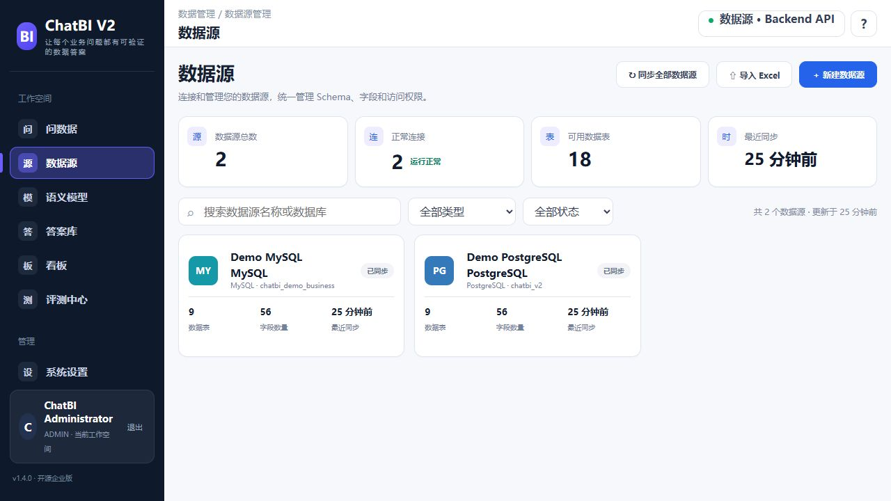
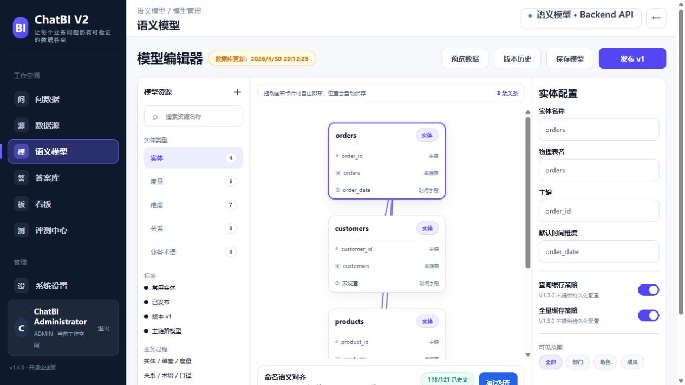
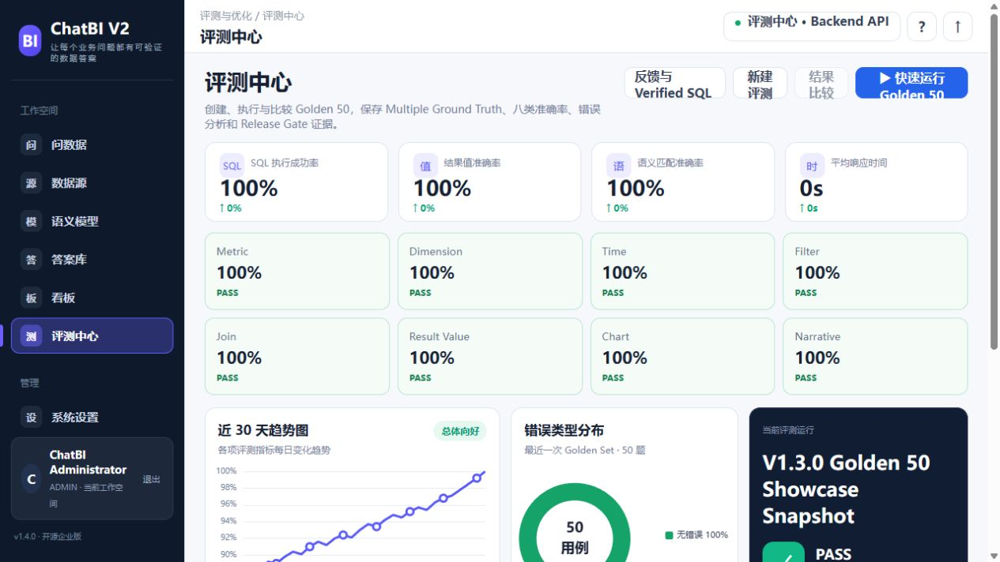
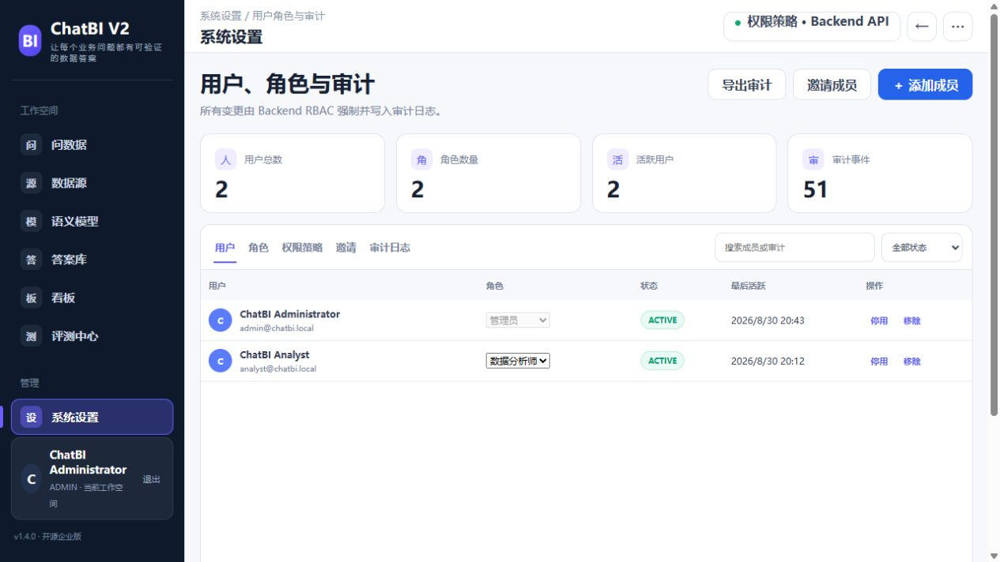

<div align="center">

[简体中文](README.md) · [English](README.en.md)

# ChatBI Studio

### Trusted, explainable, and reusable answers for enterprise data questions

Natural-language analytics · Semantic layer · Guarded NL2SQL · Result verification · Charts and insights · Continuous evaluation

[](https://github.com/wyg916/ChatBI-V2/releases/tag/v1.4.0)
[](https://github.com/wyg916/ChatBI-V2/actions/workflows/v13-phase5-release-hardening.yml)
[](LICENSE)
[](frontend)
[](backend)
[](docs/deployment/DATASOURCE.md)

[Competitive edge](#competitive-edge) · [Architecture](#architecture) · [Product](#real-product-preview) · [Quick start](#quick-start) · [Release evidence](#v140-release-evidence) · [Docs](#documentation)

</div>



> Captured from the repository's running `v1.4.0` Local Showcase with reproducible demo data. The question, SQL, values, chart, and insight travel through the real Backend API verification path.

## Project introduction video

<p align="center">
  <a href="https://github.com/wyg916/ChatBI-V2/releases/download/v1.4.0/ChatBI-Studio-v1.4.0-Introduction.mp4">
    
  </a>
</p>

<p align="center"><strong>▶ Click the cover to watch the 1:35 project introduction</strong><br><sub>1080p · Live v1.4.0 Showcase · Hosted as a GitHub Release asset</sub></p>

## ChatBI Studio in 30 seconds

ChatBI Studio is an open-source ChatBI and NL2SQL product for enterprise analytics. It turns data connectivity, business semantics, natural-language questions, read-only execution, result verification, visual insight, reusable answers, and evaluation into one governed workflow.

**ChatBI Studio** is the public product name. `ChatBI-V2` / `chatbi-v2` remain compatibility identifiers for the repository, images, packages, databases, and deployment scripts.

- **Verify answers, not just executable SQL** with Result Oracle checks for metric, dimension, time, filters, joins, output columns, and values.
- **Put business meaning into query context** through metrics, dimensions, entities, relationships, terms, and synonyms.
- **Stream a human-readable answer without rewriting facts** through real SSE delivery and a guarded Answer Presenter.
- **Connect data in a deployable way** with PostgreSQL/MySQL read-only sources and Backend-managed Excel/CSV imports.
- **Govern AI capabilities** through a unified model gateway, governed RAG, and fixed-role bounded analysis.
- **Ship reproducibly** with Bootstrap, Doctor, migrations, lifecycle scripts, backup/restore, and CI release gates.

## Competitive edge

| Capability | Product value | Engineering mechanism |
| --- | --- | --- |
| Verified query pipeline | Executable SQL is not treated as a correct business answer | `Context → NL2SQL → SQL Guard → Executor → Result Oracle` |
| Lightweight semantic layer | Removes ambiguity across tables, fields, and teams | Publishable metrics, dimensions, entities, relationships, terms, and synonyms |
| Two-layer query safety | Stops unsafe or unauthorized model output | SQLGlot AST allowlisting plus read-only transactions, timeout, row, concurrency, and masking controls |
| Verifiable answer UX | Replaces black-box responses with reviewable evidence | Conclusion, KPI, ECharts, insight, detail rows, follow-ups, SQL, and validation evidence |
| Governed knowledge and analysis | Prevents RAG/agent privilege drift | Workspace/ACL, citation and answer guards, hard budgets, and complete traces |
| Reuse and continuous improvement | Turns one-off answers into organizational assets | Verified Answers, dashboards, Golden Sets, feedback, and eight Result Oracle dimensions |

The project actively owns and maintains its product control plane, verified analytics workflow, semantic governance, result validation, AI orchestration boundaries, and delivery system. General-purpose components remain governed by their respective open-source licenses.

## Architecture



The trust boundary is explicit: **the browser talks only to the Backend API**. Database connections, provider credentials, SQL parsing and execution, authorization, result verification, and audit stay server-side.

```text
Connect datasource → synchronize Schema/Catalog → publish semantic model
→ ask in natural language → create structured SQLPlan → apply AST policy
→ execute read-only query → verify with Result Oracle → present chart and insight
→ save answer/dashboard → improve through Golden Sets and feedback
```

## Real product preview

Every image below was captured from the running `v1.4.0` Local Showcase. Screenshots contain no database passwords, provider keys, tokens, or personal accounts.

| Datasources and Schema | Draggable semantic model editor |
| --- | --- |
|  |  |
| PostgreSQL/MySQL status and catalog counts come from the Backend API. | Entity cards are draggable, bounded, de-overlapped, and position-persistent. |

| Differentiated dashboard | Golden 50 evaluation center |
| --- | --- |
|  |  |
| Trend, composition, profitability, and Verified Answer cards share one view. | Trends, error distribution, eight accuracy dimensions, and release-gate evidence. |

<p align="center">
  
</p>

<p align="center">Users, roles, resource policies, invitations, and audit events are controlled by Backend RBAC.</p>

## Product coverage

| Area | v1.4.0 capability |
| --- | --- |
| Data access | PostgreSQL/MySQL read-only sources, connection tests, Schema/Catalog sync, Excel/CSV preview and import |
| Semantic modeling | Metric, Dimension, Entity, Relationship, Business Term, Synonym, versioning, and publishing |
| Ask Data | Multi-turn context, cancellable SSE, structured SQLPlan, guarded execution, value verification, final presentation |
| Answers and dashboards | Verified Answers, result signatures, lineage, multiple ECharts types, refresh and sharing entrypoints |
| Evaluation | Golden Sets, Multiple Ground Truth, feedback, error analysis, eight accuracy dimensions, release gates |
| Governance | Secure server sessions, Workspace, roles, resource permissions, invitations, audit, and key isolation |
| Knowledge and analysis | HMAC-signed governed RAG plus ACL/citation/answer guards and bounded fixed-role analysis |

### Managed Excel and CSV

Excel import is not a raw file upload. The source file is not retained as a long-lived artifact; MIME, ZIP, formula, prompt-injection, size, row/column, sheet, and cell gates run before materialization. Imported data receives an isolated PostgreSQL schema and a dedicated least-privilege read-only role. Destructive lifecycle actions fail closed when query or Verified Answer dependencies remain.

### Bounded AI runtime

The unified Model Gateway owns capability routing, health, retry, circuit breaking, cancellation, and server-side key isolation. Core product and deterministic paths remain reproducible without an available external provider; provider balance, quota, concurrency, network, and billing policies still apply when live calls are enabled.

Governed RAG filters by Workspace and ACL before retrieval and reranking. Complex analysis is limited to five fixed roles and six allowlisted tools, with budgets of 8 steps, 12 tool calls, 2 replans, and depth 2. Agents never receive database connections; all data access returns to QueryPipeline.

## Engineering and enterprise delivery

- **Five-service Compose**: Backend, Frontend, RAG Runtime, Sandbox Controller, and Sandbox Docker Proxy; no database container or named database volume.
- **One-click Windows Showcase**: `一键启动-ChatBI-V2.cmd` runs fail-fast and has matching status, stop, and demo-reset entrypoints.
- **Controlled lifecycle**: Bootstrap creates local secrets and migrates; Doctor validates; Start, Verify, Status, Stop, Backup, and Restore have separate responsibilities.
- **Deployment isolation**: environment file, Compose project, ports, images, storage, and PostgreSQL schema can be scoped per PoC.
- **Clear data boundary**: metadata and demo business data stay in locally managed PostgreSQL/MySQL; the Frontend always uses the Backend API.
- **Replaceable interfaces**: Semantic, NL2SQL, Model, Chart, RAG, and Evaluation capabilities sit behind explicit interfaces or adapters.
- **Auditable supply chain**: migrations, dependency audit, attack gates, CycloneDX/SPDX SBOMs, and GitHub Actions provide release evidence.

## Quick start

### Local Showcase

For local product exploration and demonstrations. Requires Windows 10/11, Docker Desktop, PowerShell, and reachable local PostgreSQL/MySQL instances.

```powershell
git clone https://github.com/wyg916/ChatBI-V2.git
cd ChatBI-V2
.\scripts\bootstrap-local-databases.ps1
.\一键启动-ChatBI-V2.cmd
```

Open <http://127.0.0.1:15173/>. See the [Showcase runbook](docs/showcase/DEMO_RUNBOOK.md) for the reproducible demo flow.

### Standard open-source deployment / Enterprise PoC

```powershell
git clone https://github.com/wyg916/ChatBI-V2.git
cd ChatBI-V2
Copy-Item .env.example .env
```

Set `CHATBI_DATABASE_URL` to a least-privilege PostgreSQL application account. Use `host.docker.internal` for a database running on the Windows host, then run:

```powershell
.\scripts\bootstrap.ps1
.\scripts\doctor.ps1
.\scripts\start.ps1 -SkipBuild -SkipBootstrap
```

| Service | Default URL |
| --- | --- |
| Frontend | <http://127.0.0.1:5173/> |
| Backend health | <http://127.0.0.1:8000/health> |
| OpenAPI | <http://127.0.0.1:8000/docs> |
| RAG health | <http://127.0.0.1:8001/health> |

Read [Quick Start](docs/deployment/QUICK_START.md), [Configuration](docs/deployment/CONFIGURATION.md), and [Private deployment](docs/deployment/PRIVATE_DEPLOYMENT.md) for the complete contract.

> This source release targets local deployment, Enterprise PoC, private-deployment validation, and secondary development. A production rollout should add environment-specific TLS, network controls, high availability, observability, key rotation, recovery, and organizational compliance.

## v1.4.0 release evidence

Official release: [`v1.4.0`](https://github.com/wyg916/ChatBI-V2/releases/tag/v1.4.0) · Source commit: [`f6487737`](https://github.com/wyg916/ChatBI-V2/commit/f6487737acf817178db2f08520623a7510bc18bd)

| Gate | exact-main result |
| --- | ---: |
| Backend | 817 passed / 10 skipped / 0 failed |
| Frontend | 68 / 68 |
| Core E2E | 90 / 90 |
| Golden Set | 50 / 50 |
| Dangerous SQL blocking | 56 / 56 |
| Release security audit | 0 Critical / 0 High |
| GitHub Actions | [Phase 3 / IBM](https://github.com/wyg916/ChatBI-V2/actions/runs/33308571984) · [Phase 4](https://github.com/wyg916/ChatBI-V2/actions/runs/33308572009) · [Phase 5](https://github.com/wyg916/ChatBI-V2/actions/runs/33308571997) |

Test counts are release-gate results for this commit; they are not a coverage percentage or production SLA. See [Acceptance](docs/ACCEPTANCE.md) and [Release Notes](docs/releases/V1_4_0_RELEASE_NOTES.md).

## Technology stack

| Layer | Main technologies |
| --- | --- |
| Frontend | React 18, TypeScript, Vite, React Router, TanStack Query, ECharts |
| Backend | Python, FastAPI, Pydantic, SQLAlchemy, Alembic, SQLGlot |
| Data | PostgreSQL, MySQL, managed Excel/CSV |
| AI runtime | Model Gateway, deterministic runtime, Governed RAG, Bounded Multi-Agent |
| Delivery | Docker Compose, PowerShell, Nginx, GitHub Actions, CycloneDX, SPDX |

## Repository map

```text
frontend/          Chat-first React UI, SSE, ECharts, and Backend API client
backend/           FastAPI, semantic layer, verified QueryPipeline, RBAC, and audit
packages/          RAG, bounded orchestration, prompts, and adapter contracts
database/          Reproducible demo data for locally managed PostgreSQL/MySQL
evaluation/        Golden, complex-analysis, file/multimodal, and security cases
sandbox_runtime/   Restricted execution boundary
scripts/           Bootstrap, Showcase, deployment, validation, and release gates
docs/              Product, architecture, deployment, Showcase, release, and evidence
```

## Documentation

- [Product Charter](docs/PRODUCT_CHARTER.md) · [Architecture](docs/ARCHITECTURE.md) · [Acceptance](docs/ACCEPTANCE.md)
- [Quick Start](docs/deployment/QUICK_START.md) · [Datasource onboarding](docs/deployment/DATASOURCE.md) · [Backup and restore](docs/deployment/BACKUP_RESTORE.md)
- [Security](docs/deployment/SECURITY.md) · [Upgrade](docs/deployment/UPGRADE.md) · [Rollback](docs/deployment/ROLLBACK.md)
- [Showcase](docs/showcase/README.md) · [3–5 minute video script](docs/showcase/VIDEO_SCRIPT_3_TO_5_MIN.md) · [Interview talk track](docs/showcase/INTERVIEW_TALK_TRACK.md)
- [CHANGELOG](CHANGELOG.md) · [Releases](https://github.com/wyg916/ChatBI-V2/releases) · [Support](SUPPORT.md)

## Contributing

Issues, tests, documentation, and code contributions that strengthen the ChatBI workflow are welcome. Read [CONTRIBUTING.md](CONTRIBUTING.md), the [Code of Conduct](CODE_OF_CONDUCT.md), and [SECURITY.md](SECURITY.md) before contributing.

## License and notices

ChatBI Studio is released under the [Apache License 2.0](LICENSE). Distributions and derivative work must also retain the [Third-Party Notices](THIRD_PARTY_NOTICES.md), [open-source license audit](docs/OPEN_SOURCE_LICENSE_AUDIT.md), [CycloneDX SBOM](docs/sbom/V1_4_0.cdx.json), and [SPDX SBOM](docs/sbom/V1_4_0.spdx.json).

---

<div align="center">

**ChatBI Studio — from a natural-language question to a verifiable data answer.**

[GitHub Release](https://github.com/wyg916/ChatBI-V2/releases/tag/v1.4.0) · [Issues](https://github.com/wyg916/ChatBI-V2/issues) · [Security](SECURITY.md)

</div>
