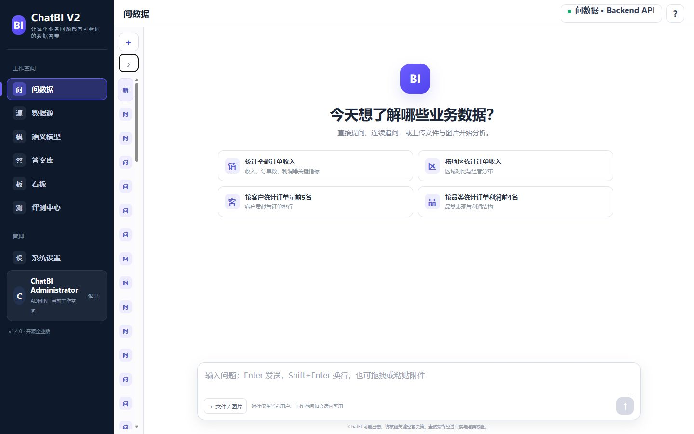

# ChatBI V2

[简体中文](README.md) | English

> An enterprise-oriented open-source ChatBI and NL2SQL product for governed natural-language analytics, semantic models, verifiable query results, dashboards, and continuous evaluation.

[](https://github.com/wyg916/ChatBI-V2/releases)
[](LICENSE)
[](frontend)
[](backend)



ChatBI V2 is deliberately ChatBI-first. Datasources, catalog synchronization, semantic models, guarded NL2SQL, read-only execution, result verification, answers, dashboards, and evaluation form one product workflow. It is not a general AI platform, unrestricted agent framework, or model-management product.

## Why ChatBI V2

- **Verifiable results** — SQL AST authorization, read-only execution, `EXPLAIN`, Result Oracle, result signatures, and audit events constrain every data answer.
- **Lightweight semantic layer** — metrics, dimensions, entities, relationships, business terms, and synonyms.
- **Governed enterprise knowledge** — Workspace/RBAC/ACL filtering, signed RAG calls, citation verification, and answer guards.
- **Bounded complex analysis** — five fixed roles, six allowlisted tools, hard step/call/depth/deadline budgets, and complete trace metadata.
- **Replaceable runtime boundaries** — semantic, NL2SQL, model, chart, RAG, and evaluation capabilities sit behind project-owned adapters.
- **Useful without paid model keys** — deterministic local paths remain available; optional live providers report their real configuration and health state.

## Core workflow

```text
Connect datasource → synchronize schema/catalog → publish semantic model
→ ask in natural language → generate and guard read-only SQL
→ execute and verify values → create chart and business insight
→ save answer/dashboard → evaluate and improve
```

The browser calls only the Backend `/api/v1`. Database credentials, provider keys, SQL execution, policy checks, and result verification remain server-side.

## Capabilities in v1.4.0

- PostgreSQL and MySQL read-only datasources.
- Managed Excel/CSV imports materialized into isolated PostgreSQL schemas with dedicated read-only roles.
- Catalog synchronization and a publishable semantic model.
- Streaming ChatBI answers with stable SSE contracts and guarded final presentation.
- ECharts results, business insights, detail tables, follow-up questions, and evidence drawers.
- Verified answer library, differentiated dashboards, and Backend-backed evaluation trends.
- User, role, resource-permission, invitation, and audit controls.
- Controlled RAG and fixed-role bounded analysis for knowledge and complex questions.

## Quick start

### Requirements

- Windows 10/11 with PowerShell 7 recommended
- Docker Desktop
- Git
- PostgreSQL 15+ reachable from Docker
- 8 GB RAM and approximately 10 GB free disk for the first build

Clone and create a local configuration:

```powershell
git clone https://github.com/wyg916/ChatBI-V2.git
cd ChatBI-V2
Copy-Item .env.example .env
```

Set `CHATBI_DATABASE_URL` to a least-privilege PostgreSQL application account. For a database on the Windows host, use `host.docker.internal`, not container-local `localhost`.

```powershell
.\scripts\bootstrap.ps1
.\scripts\doctor.ps1
.\scripts\start.ps1 -SkipBuild -SkipBootstrap
```

Default endpoints:

- Frontend: <http://127.0.0.1:5173/>
- Backend health: <http://127.0.0.1:8000/health>
- OpenAPI: <http://127.0.0.1:8000/docs>
- RAG health: <http://127.0.0.1:8001/health>

See [Quick Start](docs/deployment/QUICK_START.md) and [Configuration](docs/deployment/CONFIGURATION.md) for the full deployment contract.

## Local Showcase

The Showcase uses reproducible demo data in locally installed PostgreSQL/MySQL and binds its published ports to `127.0.0.1`.

```powershell
.\scripts\bootstrap-local-databases.ps1
.\一键启动-ChatBI-V2.cmd
```

The default `Auto` mode can route configured MiMo, DeepSeek, and Kimi providers. `Deterministic` provides a reproducible zero-provider-call mode:

```powershell
.\scripts\showcase.ps1 -Action Start -ProviderMode Deterministic -NoOpen
```

Unrestricted Showcase routing removes only ChatBI's internal estimated-cost admission limits for the three named providers. Provider billing, balance, quota, concurrency, network, and safety policies still apply.

## Architecture

```text
React + TypeScript + ECharts
            │ /api/v1
            ▼
FastAPI ── Authentication / Workspace / RBAC / Audit
  ├── Semantic Context → NL2SQL → SQL Guard → Read-only Executor → Result Oracle
  ├── Governed RAG → ACL → Citation Guard → Answer Guard
  ├── Fixed five-role orchestration → six allowlisted tools
  └── PostgreSQL metadata + external read-only business datasources
```

Read [Architecture](docs/ARCHITECTURE.md) for runtime and trust-boundary details.

## Security model

- Generated SQL is limited to one `SELECT` or `WITH ... SELECT` statement.
- DDL, DML, multiple statements, file access, external programs, and dangerous functions are rejected.
- Datasource accounts must be least-privilege and read-only.
- Timeouts, row limits, fair concurrency, masking, Workspace isolation, ACLs, audit events, and result signatures are enforced server-side.
- Provider credentials never belong in frontend code, Git history, screenshots, traces, or evidence artifacts.

Report vulnerabilities privately as described in [SECURITY.md](SECURITY.md).

## Development and validation

```powershell
py -3.11 -m venv .venv
.\.venv\Scripts\python.exe -m pip install --upgrade pip
.\.venv\Scripts\python.exe -m pip install -r backend\requirements.txt
$env:PYTHONPATH = (Resolve-Path backend)
.\.venv\Scripts\python.exe -m pytest backend\tests -q

cd frontend
npm ci
npm run typecheck
npm test -- --run
npm run build
```

Additional migration, Golden, E2E, sandbox, supply-chain, and release gates are defined in `.github/workflows/` and `docs/ACCEPTANCE.md`. The current candidate inventories are available as [CycloneDX](docs/sbom/V1_4_0.cdx.json) and [SPDX](docs/sbom/V1_4_0.spdx.json) SBOMs.

## Release status and limitations

The release-candidate source version is v1.4.0 and the intended release tag is `v1.4.0`. A release is official only when a matching immutable tag and GitHub Release exist in [Releases](https://github.com/wyg916/ChatBI-V2/releases). The tracked [Release Candidate Manifest](docs/releases/V1_4_0_FINAL_MANIFEST.md) is a pre-publication checklist; final remote SHA, tag and Release URL facts belong to the post-publication external attestation.

ChatBI V2 is suitable for local deployment, Enterprise PoC, private-deployment validation, and secondary development. It is not a production certification. Kubernetes/Helm packaging, HA PostgreSQL, multi-node disaster recovery, production key rotation, signed immutable OCI images, production monitoring, and an SLA remain outside this source release.

See [v1.4.0 Release Notes](docs/releases/V1_4_0_RELEASE_NOTES.md), [CHANGELOG](CHANGELOG.md), and [Rollback](docs/releases/V1_4_0_ROLLBACK.md).

## Contributing and license

Read [CONTRIBUTING.md](CONTRIBUTING.md), [Code of Conduct](CODE_OF_CONDUCT.md), [Support](SUPPORT.md), [Third-Party Notices](THIRD_PARTY_NOTICES.md), and the [open-source license audit](docs/OPEN_SOURCE_LICENSE_AUDIT.md).

ChatBI V2 is released under the [Apache License 2.0](LICENSE). Third-party components retain their own licenses and notices. This is an independent open-source project and is not affiliated with, endorsed by, or sponsored by the upstream projects or model providers referenced in the documentation.
