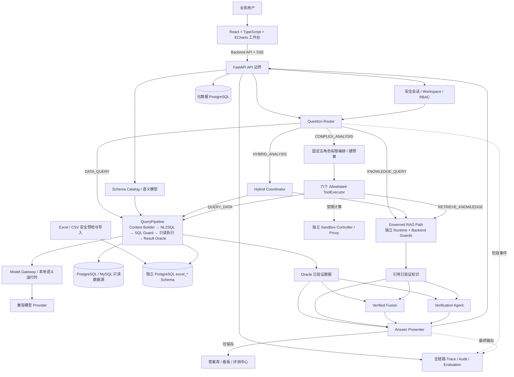
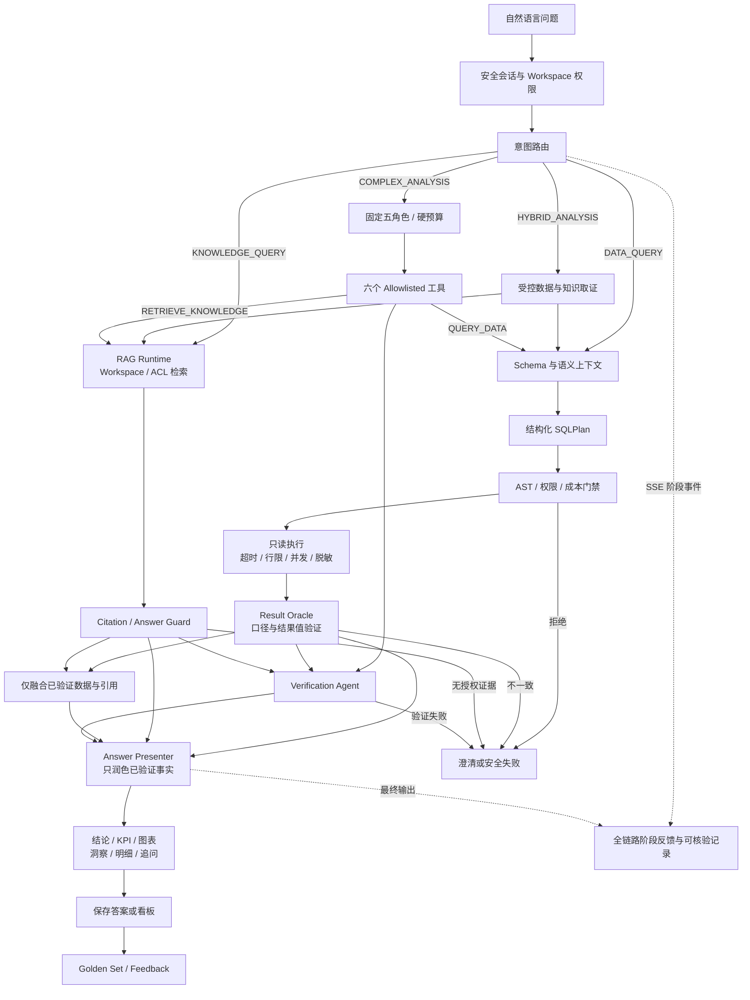

<div align="center">

[简体中文](README.md) · [English](README.en.md)

# ChatBI Studio

### 让企业数据问题，得到可信、可解释、可复用的答案

自然语言问数 · 轻量语义层 · 受控 NL2SQL · 结果值验证 · 自动图表与洞察 · 持续评测

[](https://github.com/wyg916/ChatBI-V2/releases/tag/v1.4.0)
[](https://github.com/wyg916/ChatBI-V2/actions/workflows/v13-phase5-release-hardening.yml)
[](LICENSE)
[](frontend)
[](backend)
[](docs/deployment/DATASOURCE.md)

[核心竞争力](#核心竞争力) · [技术架构](#技术架构) · [产品预览](#真实产品预览) · [快速部署](#快速开始) · [发布证据](#v140-发布证据) · [文档](#文档导航)

</div>

## 项目介绍视频

https://github.com/user-attachments/assets/217ddbba-2915-4650-80ca-8fbf799615ef

> 2 分 12 秒真实产品演示。使用 GitHub 原生视频附件播放器，点击播放、不自动下载；画面来自本仓库 `v1.4.0` Local Showcase 与可复现模拟业务数据。

## 30 秒了解 ChatBI Studio

ChatBI Studio 是面向企业数据分析的开源 ChatBI / NL2SQL 产品。它把数据连接、业务语义、自然语言查询、只读执行、结果验证、图表洞察、答案复用和持续评测做成一条完整链路。

**ChatBI Studio** 是当前对外产品名；`ChatBI-V2` / `chatbi-v2` 继续作为仓库、镜像、包、数据库与部署脚本的兼容标识。

- **不只生成 SQL，更验证答案**：Result Oracle 检查指标、维度、时间、过滤、Join、输出列和结果值。
- **让业务口径进入查询上下文**：Metric、Dimension、Entity、Relationship、Business Term 与 Synonym 共同约束 NL2SQL。
- **让回答更自然，但不改写事实**：真实 SSE 增量流配合 Answer Presenter；最终表达不能越过已验证结果。
- **让数据接入真正可落地**：支持 PostgreSQL、MySQL 只读数据源，以及由 Backend 管理的 Excel / CSV 导入。
- **让 AI 能力可治理**：统一模型网关、受控 RAG、固定五角色/六工具的有限编排，均受权限、预算与审计约束。
- **让交付可复现**：Bootstrap、Doctor、Migration、Start、Verify、Backup、Restore 与 CI Release Gate 形成工程闭环。

## 核心竞争力

| 能力 | 解决的问题 | 工程落点 |
| --- | --- | --- |
| 可信问数主链路 | SQL 能执行不等于业务答案正确 | `Context → NL2SQL → SQL Guard → Executor → Result Oracle` |
| 轻量语义层 | 同一指标在不同表、字段和团队间容易产生歧义 | 可发布的指标、维度、实体、关系、术语与同义词模型 |
| 双层查询安全 | 防止模型绕过权限或生成危险 SQL | SQLGlot AST 白名单 + 只读事务、超时、行限、并发与脱敏 |
| 可验证回答体验 | 避免“黑盒答案”和生硬模板 | 结论、KPI、ECharts、洞察、明细、追问、SQL 与验证证据 |
| 受控知识与复杂分析 | RAG/Agent 容易越权、失控或绕过数据边界 | Workspace/ACL、Citation Guard、Answer Guard、硬预算与完整 Trace |
| 复用与持续优化 | 一次性问答无法沉淀为组织资产 | Verified Answer、看板、Golden Set、反馈与八类 Result Oracle 评测 |

项目重点自主维护产品控制面、可信问数链路、语义治理、结果验证、AI 编排边界与工程化交付体系；底层通用组件按各自开源许可证进行治理。

## 技术架构



核心信任边界只有一条：**浏览器只访问 Backend API**。数据库连接、模型凭据、SQL 解析与执行、权限校验、结果验证和审计全部留在服务端。

### 从问题到可信答案



任何安全门禁失败或结果值不一致都会失败关闭：系统返回澄清或可解释错误，不把未经验证的内容包装成业务答案。

## 真实产品预览

以下页面均从当前 `v1.4.0` 本机 Showcase 实际运行环境采集；截图未包含数据库密码、Provider Key、Token 或个人账号。

| 数据源与 Schema | 可拖动语义模型编辑器 |
| --- | --- |
|  |  |
| PostgreSQL / MySQL 状态、表与字段统计均来自 Backend API。 | 实体关系卡片可拖动，位置自动保存，并具备边界与防重叠约束。 |

| 差异化经营看板 | Golden 50 评测中心 |
| --- | --- |
|  |  |
| 折线、环图、区域利润率与 Verified Answer 卡片组合展示。 | 趋势、错误分布、八类准确率与 Release Gate 证据统一呈现。 |

<p align="center">
  
</p>

<p align="center">用户、角色、权限策略、邀请与审计事件由 Backend RBAC 统一控制。</p>

## 产品能力

| 领域 | v1.4.0 能力 |
| --- | --- |
| 数据接入 | PostgreSQL / MySQL 只读连接、连接测试、Schema/Catalog 同步、Excel/CSV Preview 与导入 |
| 语义建模 | Metric、Dimension、Entity、Relationship、Business Term、Synonym、版本与发布 |
| 问数据 | 多轮上下文、可取消 SSE、结构化 SQLPlan、安全执行、结果验证、自然化表达 |
| 答案与看板 | Verified Answer、结果签名、来源追溯、多类型 ECharts、刷新与分享入口 |
| 评测优化 | Golden Set、Multiple Ground Truth、反馈、错误分析、八类准确率、发布门禁 |
| 企业治理 | 服务端安全会话、Workspace、角色、资源权限、邀请、审计与密钥隔离 |
| 知识与分析 | HMAC 签名的受控 RAG、ACL/Citation/Answer Guard、有限多角色编排 |

### Excel / CSV 作为受管数据源

Excel 导入不是简单上传文件：原文件不长期落盘，导入前检查 MIME、ZIP、公式、提示词注入、体积、行列、Sheet 与 Cell 边界；数据物化到独立 PostgreSQL Schema，并使用独立最小权限只读角色。删除时先检查 QueryRun 与 Verified Answer 依赖，无法证明安全时失败关闭。

### 有边界的 AI 运行时

统一 Model Gateway 负责能力路由、健康检查、重试、熔断、取消与服务端密钥隔离。没有可用 Provider 时，基础产品和 deterministic 路径仍可复现运行；启用外部 Provider 时，其余额、额度、并发、网络和计费策略仍由供应商决定。

受控 RAG 先执行 Workspace 与 ACL 过滤，再进行检索和重排；复杂分析只允许固定五角色、六个 allowlisted 工具，最多 8 步、12 次工具调用、2 次重规划和深度 2。Agent 不获得数据库连接，数据查询始终回到 QueryPipeline。

## 企业级工程与快速落地

- **五服务 Compose**：Backend、Frontend、RAG Runtime、Sandbox Controller、Sandbox Docker Proxy；不创建数据库容器或数据库 volume。
- **Windows 一键启动**：根目录 `一键启动-ChatBI-V2.cmd` 采用逐步 fail-fast，并配套状态、停止和演示数据重置入口。
- **标准化生命周期**：Bootstrap 生成本地 Secret 并执行迁移；Doctor 前置检查；Start / Verify / Status / Stop / Backup / Restore 分工明确。
- **部署隔离**：环境文件、Compose 项目名、端口、镜像和 PostgreSQL Schema 可独立配置，适合并行 PoC 与二次开发。
- **数据边界清晰**：元数据和演示业务数据保存在本机 PostgreSQL/MySQL；Frontend 始终只通过 Backend API 访问。
- **可替换接口**：Semantic、NL2SQL、Model、Chart、RAG 与 Evaluation 均通过明确接口或 Adapter 接入。
- **供应链可审计**：Alembic migration、依赖审计、攻击门禁、CycloneDX/SPDX SBOM 与 GitHub Actions 共同构成发布证据。

## 快速开始

### 方式一：Local Showcase 一键体验

适合本机演示、功能体验和项目讲解。需要 Windows 10/11、Docker Desktop、PowerShell，以及本机可用的 PostgreSQL/MySQL。

```powershell
git clone https://github.com/wyg916/ChatBI-V2.git
cd ChatBI-V2
.\scripts\bootstrap-local-databases.ps1
.\一键启动-ChatBI-V2.cmd
```

启动完成后即可进入 Web 工作台。完整流程与状态检查方式见 [Showcase 操作手册](docs/showcase/DEMO_RUNBOOK.md)。

### 方式二：标准开源部署 / Enterprise PoC

```powershell
git clone https://github.com/wyg916/ChatBI-V2.git
cd ChatBI-V2
Copy-Item .env.example .env
```

将 `.env` 中的 `CHATBI_DATABASE_URL` 配置为最小权限 PostgreSQL 应用账号；Windows 宿主数据库应使用 `host.docker.internal`，随后执行：

```powershell
.\scripts\bootstrap.ps1
.\scripts\doctor.ps1
.\scripts\start.ps1 -SkipBuild -SkipBootstrap
```

启动后使用项目提供的 Doctor、Verify 与 Status 入口检查服务状态。完整部署契约见 [Quick Start](docs/deployment/QUICK_START.md)、[配置参考](docs/deployment/CONFIGURATION.md) 与 [私有部署](docs/deployment/PRIVATE_DEPLOYMENT.md)。

> 本源码发布面向本地部署、Enterprise PoC、私有化部署验证与二次开发。进入正式生产前，应结合目标环境完成 TLS、网络收口、高可用、监控、密钥轮换、备份恢复和组织合规设计。

## v1.4.0 发布证据

正式版本：[`v1.4.0`](https://github.com/wyg916/ChatBI-V2/releases/tag/v1.4.0) · 源码提交：[`f6487737`](https://github.com/wyg916/ChatBI-V2/commit/f6487737acf817178db2f08520623a7510bc18bd)

| 发布门禁 | exact-main 结果 |
| --- | ---: |
| Backend | 817 passed / 10 skipped / 0 failed |
| Frontend | 68 / 68 |
| Core E2E | 90 / 90 |
| Golden Set | 50 / 50 |
| 危险 SQL 阻断 | 56 / 56 |
| 发布安全审计 | 0 Critical / 0 High |
| GitHub Actions | [Phase 3 / IBM](https://github.com/wyg916/ChatBI-V2/actions/runs/33308571984) · [Phase 4](https://github.com/wyg916/ChatBI-V2/actions/runs/33308572009) · [Phase 5](https://github.com/wyg916/ChatBI-V2/actions/runs/33308571997) |

测试数量表示该发布提交上的门禁结果，不等同于代码覆盖率或生产 SLA。更多证据见 [Acceptance](docs/ACCEPTANCE.md) 与 [Release Notes](docs/releases/V1_4_0_RELEASE_NOTES.md)。

## 技术栈

| 层 | 主要技术 |
| --- | --- |
| Frontend | React 18、TypeScript、Vite、React Router、TanStack Query、ECharts |
| Backend | Python、FastAPI、Pydantic、SQLAlchemy、Alembic、SQLGlot |
| Data | PostgreSQL、MySQL、受管 Excel / CSV |
| AI Runtime | Model Gateway、deterministic runtime、Governed RAG、Bounded Multi-Agent |
| Delivery | Docker Compose、PowerShell、Nginx、GitHub Actions、CycloneDX、SPDX |

## 项目结构

```text
frontend/          Chat-first React UI、SSE、ECharts 与 Backend API client
backend/           FastAPI、语义层、可信 QueryPipeline、RBAC 与审计
packages/          RAG、有限编排、Prompt 与 Adapter 契约
database/          本机 PostgreSQL/MySQL 可复现模拟业务数据
evaluation/        Golden、复杂分析、文件/多模态与安全用例
sandbox_runtime/   受限执行边界
scripts/           初始化、Showcase、部署、验证与发布门禁
docs/              产品、架构、部署、演示、Release 与 Evidence
```

## 文档导航

- [产品章程](docs/PRODUCT_CHARTER.md) · [技术架构](docs/ARCHITECTURE.md) · [验收标准](docs/ACCEPTANCE.md)
- [Quick Start](docs/deployment/QUICK_START.md) · [数据源接入](docs/deployment/DATASOURCE.md) · [备份恢复](docs/deployment/BACKUP_RESTORE.md)
- [安全部署](docs/deployment/SECURITY.md) · [升级](docs/deployment/UPGRADE.md) · [回滚](docs/deployment/ROLLBACK.md)
- [Showcase 导航](docs/showcase/README.md) · [3～5 分钟视频脚本](docs/showcase/VIDEO_SCRIPT_3_TO_5_MIN.md) · [面试讲解稿](docs/showcase/INTERVIEW_TALK_TRACK.md)
- [CHANGELOG](CHANGELOG.md) · [Releases](https://github.com/wyg916/ChatBI-V2/releases) · [Support](SUPPORT.md)

## 参与贡献

欢迎围绕 ChatBI 主链路提交 Issue、测试、文档和代码贡献。开始前请阅读 [CONTRIBUTING.md](CONTRIBUTING.md)、[Code of Conduct](CODE_OF_CONDUCT.md) 与 [SECURITY.md](SECURITY.md)。

## 许可证与声明

ChatBI Studio 以 [Apache License 2.0](LICENSE) 发布。分发或二次开发时请同时保留 [Third-Party Notices](THIRD_PARTY_NOTICES.md)、[开源许可证审计](docs/OPEN_SOURCE_LICENSE_AUDIT.md)、[CycloneDX SBOM](docs/sbom/V1_4_0.cdx.json) 与 [SPDX SBOM](docs/sbom/V1_4_0.spdx.json)。

---

<div align="center">

**ChatBI Studio — 从自然语言问题，到可验证的数据答案。**

[GitHub Release](https://github.com/wyg916/ChatBI-V2/releases/tag/v1.4.0) · [问题反馈](https://github.com/wyg916/ChatBI-V2/issues) · [安全报告](SECURITY.md)

</div>
