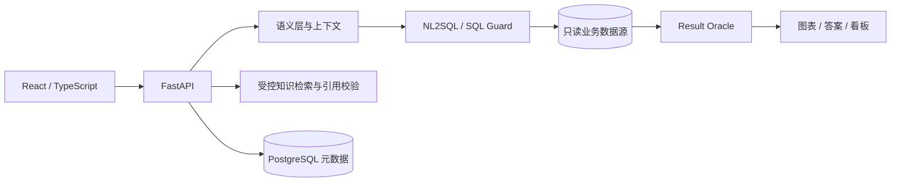

# ChatBI Studio

[English](README.en.md) · [安装部署](INSTALL.md) · [架构](docs/ARCHITECTURE.md) · [许可证](LICENSE)

面向企业数据分析的开源 ChatBI 产品，连接业务数据库，以自然语言查询生成可验证的结果、图表和业务洞察。

## 核心能力

- PostgreSQL / MySQL 只读数据源连接、Schema 同步与 Excel / CSV 导入。
- 指标、维度、实体、关系、业务术语与同义词组成的轻量语义层。
- 自然语言问数、SQL AST 校验、只读执行、超时与行数限制。
- Result Oracle 结果校验、ECharts 图表、答案保存和看板卡片。
- 受控 RAG、引用校验、固定角色的有限编排与统一模型网关。
- Workspace 权限、服务端会话、审计与评测记录。

## 技术架构



数据库连接和模型凭据仅保存在服务端。前端统一通过 Backend API 访问数据。

## 快速开始

准备 Docker Compose、PowerShell 和可从容器访问的 PostgreSQL，创建专用应用账号与元数据库。

```powershell
git clone https://github.com/wyg916/ChatBI-V2.git
cd ChatBI-V2
Copy-Item .env.example .env
# 在 .env 中填写 CHATBI_DATABASE_URL
.\scripts\start.ps1
```

默认访问地址为 `http://localhost:5173`。初始化只创建工作区、登录身份、受控工具和系统提示模板。登录后连接自己的只读数据源、建立语义模型并开始问数。详细配置及凭据获取见 [安装说明](INSTALL.md)。

## 仓库结构

| 目录 | 用途 |
| --- | --- |
| `backend/` | API、查询引擎、连接器、语义层、数据库迁移 |
| `frontend/` | React 用户界面与图表 |
| `packages/` | RAG、编排、提示与第三方适配接口 |
| `sandbox_runtime/` | 受限计算执行环境 |
| `scripts/` | 初始化、部署、检查、备份与恢复 |
| `docs/` | 架构、部署、配置与许可证依据 |

## 文档

- [产品范围](docs/PRODUCT_CHARTER.md)
- [数据源配置](docs/deployment/DATASOURCE.md)
- [模型配置](docs/MODEL_PROVIDERS.md)
- [备份恢复](docs/deployment/BACKUP_RESTORE.md)
- [贡献指南](CONTRIBUTING.md)
- [安全政策](SECURITY.md)
- [第三方声明](THIRD_PARTY_NOTICES.md)

项目采用 [Apache-2.0](LICENSE)。第三方组件遵循各自许可证。
