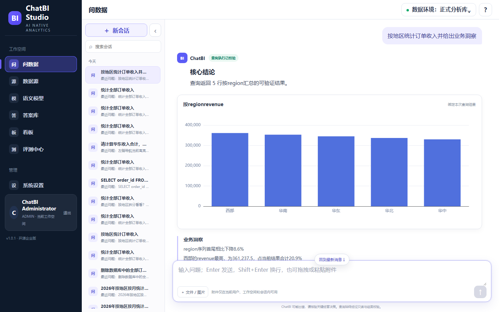

# ChatBI V2

> 面向企业数据分析的开源 ChatBI / NL2SQL 产品，支持本地部署、私有化部署、Enterprise PoC 与二次开发；把自然语言问题转换为受语义层约束的只读 SQL，并返回可验证结果、图表、业务洞察与审计证据。

[](https://github.com/wyg916/ChatBI-V2/releases/tag/chatbi-v2-v1.3.1)
[](LICENSE)
[](frontend)
[](backend)



ChatBI V2 始终是 ChatBI-first 产品：数据源、语义模型、问数据、可验证答案、看板和评测处于同一条主链路。它不是通用 AI、知识库、Agent 或模型管理平台。Local Showcase 仅用于本机体验、作品集演示和面试讲解，不代表生产部署认证。

## 为什么选择 ChatBI V2

- **结果可验证**：SQL AST Guard、只读执行、Result Oracle、结果签名和审计记录共同约束答案。
- **轻量语义层**：Metric、Dimension、Entity、Relationship、Business Term、Synonym。
- **企业知识受控**：RAG 受 Workspace、RBAC、ACL、Citation Guard 和 Answer Guard 约束。
- **复杂分析有界**：固定五角色、六个 allowlisted 工具、硬预算和完整 Trace；Agent 不直连数据库。
- **运行时可替换**：Semantic Engine、NL2SQL Engine、Model Provider、Chart Engine、RAG 和评测均通过明确 Adapter 接入。
- **无 Provider Key 也可启动**：基础产品和 deterministic NL2SQL 路径可本地运行；live AI 会明确报告 Provider 配置状态。

## 核心产品链路

```text
连接数据源 → 同步 Schema / Catalog → 建立并发布语义模型
→ 自然语言提问 → 生成并校验只读 SQL → 执行并验证结果值
→ 生成图表与业务结论 → 保存答案或看板 → 进入评测与持续优化
```

浏览器只调用 Backend `/api/v1`。数据库凭据、SQL 执行、Provider Key、安全校验与结果验证全部留在服务端。

## 三种使用模式

### 1. Default Open Source

适合首次体验、开源贡献和本地二次开发。前置条件：Windows 10/11、PowerShell 7（推荐）、Docker Desktop、Git，以及 Docker 可访问的 PostgreSQL 15+。首次构建建议 8 GB RAM 和 10 GB 可用磁盘。

```powershell
git clone https://github.com/wyg916/ChatBI-V2.git
cd ChatBI-V2
Copy-Item .env.example .env
```

编辑 `.env`，把 `CHATBI_DATABASE_URL` 设置为最小权限的 PostgreSQL 应用账号；Windows 宿主数据库使用 `host.docker.internal`，不能使用容器内的 `localhost`。随后运行：

```powershell
.\scripts\doctor.ps1
.\scripts\bootstrap.ps1
.\scripts\start.ps1 -SkipBuild
```

Bootstrap 只生成仍为占位符的四个本地应用 Secret，执行 Alembic migration，并幂等创建 Workspace 与登录身份。默认 `CHATBI_SEED_DEMO_SEMANTIC_MODEL=false`，企业 Fresh Deployment 不依赖演示数据。

默认地址：Frontend <http://127.0.0.1:5173/>，Backend health <http://127.0.0.1:8000/health>，API docs <http://127.0.0.1:8000/docs>，RAG health <http://127.0.0.1:8001/health>。端口和项目名均可在环境文件中覆盖。

完整说明见 [Quick Start](docs/deployment/QUICK_START.md) 和 [配置参考](docs/deployment/CONFIGURATION.md)。

### 2. Local Showcase

适合本机作品集演示和面试讲解。它使用本机 PostgreSQL/MySQL 的可复现模拟业务数据、固定端口 `15173/18080/18081`、独立 Compose 项目名和 documented local-only 账号，并强制把三个发布端口绑定到 `127.0.0.1`，不会把固定演示凭据暴露到局域网网卡。根目录一键入口使用 `ProviderMode Auto`：只要 MiMo、DeepSeek 或 Kimi 任一凭据已配置，就启用三家 Provider 的自动能力路由和 `quality` 模式，关闭 ChatBI 测试付费门禁，并取消三者的内部估算费用上限、Kimi 复杂度准入和 Provider 候选/重试次数裁剪；没有可用凭据时安全回退到 `deterministic / LEVEL0 / no-paid`。Compose 不创建数据库容器或数据库 volume。

首次初始化本机演示数据库后，可使用根目录入口：

```powershell
.\scripts\bootstrap-local-databases.ps1
.\一键启动-ChatBI-V2.cmd
.\一键停止-ChatBI-V2.cmd
.\一键重置-ChatBI-V2-演示数据.cmd
```

也可使用命令行：

```powershell
.\scripts\showcase.ps1 -Action Start -NoOpen
.\scripts\showcase.ps1 -Action Status
.\scripts\showcase.ps1 -Action Stop
.\scripts\showcase.ps1 -Action Reset -NoOpen
```

需要稳定、零付费的录屏或回归时，可显式选择确定性模式：

```powershell
.\scripts\showcase.ps1 -Action Start -ProviderMode Deterministic -NoOpen
```

`Auto`/`Live` 不受 ChatBI 内部测试付费、估算费用或 Kimi 准入限制，但仍尊重系统设置中的管理员启停、模型能力/健康状态、回答安全门禁，以及 Provider 账号自身的余额、额度、并发和网络策略；实际调用可能产生供应商费用。

启动后访问 <http://127.0.0.1:15173/>。Showcase 的固定凭据仅用于明确标记的本机演示 Seed 路径，不得复制到企业配置。

Showcase 重点展示 7 个能力：

1. Chat-first 登录与问数据。
2. PostgreSQL / MySQL 数据源连接、Schema 与 Catalog 同步。
3. Metric、Dimension、Entity、Relationship、Business Term、Synonym 语义层。
4. Context → NL2SQL → SQL Guard → Query Executor → Result Oracle。
5. 一句话结论、KPI、ECharts、洞察、明细、追问和证据抽屉。
6. Workspace ACL 受控 RAG 与固定五角色/六工具有限编排。
7. Verified Answer、Dashboard、Golden Set 和安全回归闭环。

演示材料：

- [Showcase 导航](docs/showcase/README.md)
- [本地 Demo 操作手册](docs/showcase/DEMO_RUNBOOK.md)
- [3～5 分钟视频脚本](docs/showcase/VIDEO_SCRIPT_3_TO_5_MIN.md)
- [8～10 分钟视频脚本](docs/showcase/VIDEO_SCRIPT_8_TO_10_MIN.md)
- [面试讲解稿](docs/showcase/INTERVIEW_TALK_TRACK.md)

### 3. Enterprise PoC

适合在独立项目名、端口、镜像、存储目录和 PostgreSQL Schema 下进行私有 PoC。复制一份专用环境文件，配置只读业务数据源与服务端 Provider（如需要），先执行 Doctor，再 Bootstrap/Start。Stop、Reset、Backup 和 Restore 都绑定该环境文件和 Compose 项目名，不会操作其他部署。

```powershell
.\scripts\doctor.ps1 -EnvFile .env.enterprise
.\scripts\bootstrap.ps1 -EnvFile .env.enterprise
.\scripts\start.ps1 -EnvFile .env.enterprise -SkipBuild
.\scripts\status.ps1 -EnvFile .env.enterprise
.\scripts\stop.ps1 -EnvFile .env.enterprise
```

运维入口：

```powershell
.\scripts\backup.ps1 -EnvFile .env.enterprise
.\scripts\restore.ps1 -EnvFile .env.enterprise -Name <backup-name> -Force
.\scripts\reset.ps1 -EnvFile .env.enterprise -Force
```

Metadata Reset 还要求 local mode、`CHATBI_ALLOW_METADATA_RESET=YES`、显式 `chatbi_*` Schema、`-Metadata` 和确认参数；不会执行 `docker system prune`，也不会删除企业业务数据源。

企业文档：

- [Private deployment](docs/deployment/PRIVATE_DEPLOYMENT.md)
- [Datasource onboarding](docs/deployment/DATASOURCE.md)
- [Backup and restore](docs/deployment/BACKUP_RESTORE.md)
- [Upgrade](docs/deployment/UPGRADE.md)
- [Rollback](docs/deployment/ROLLBACK.md)
- [Troubleshooting](docs/deployment/TROUBLESHOOTING.md)
- [Security](docs/deployment/SECURITY.md)

## Provider 配置

MiMo、DeepSeek、Kimi 使用服务端统一 Model Gateway。基础启动不要求 Key；live Provider 功能只需在 `.env` 中设置对应 Key：

```text
CHATBI_MIMO_API_KEY=
CHATBI_DEEPSEEK_API_KEY=
CHATBI_KIMI_API_KEY=
```

Key 不返回浏览器，也不写入 Trace 或 Evidence。`CHATBI_MODEL_PROVIDER=auto` 只使用已配置且启用的 Provider，否则保留 deterministic 本地路径。本机一键 `Auto`/`Live` 会设置 `CHATBI_PROVIDER_USAGE_UNRESTRICTED=true`，让三家 Provider 均可进入能力/健康路由而不受 ChatBI 内部费用阈值限制。详见 [Model Control Plane](docs/runtime/MODEL_CONTROL_PLANE.md)。

## Datasource 与演示数据

PostgreSQL 是 Metadata 与主验证数据库；MySQL 是只读兼容 Datasource。企业部署通过产品完成：

```text
Add Datasource → Test Connection → Schema Sync → Catalog Sync
→ Semantic Binding → Publish → ChatBI
```

本地快速体验可由 `scripts/bootstrap-local-databases.ps1` 在已安装的 PostgreSQL/MySQL 中写入可复现模拟业务数据。Frontend 始终通过 Backend API 访问数据，Compose 仅包含 Backend、RAG Runtime、Sandbox Controller/Proxy、Frontend，以及按 profile 启用的 PostgreSQL maintenance client；没有数据库服务或数据库 volume。

## 架构

```text
React + TypeScript + ECharts
            │ /api/v1
            ▼
FastAPI ── Auth / Workspace / RBAC / Audit
  ├── Semantic Context → NL2SQL → SQL Guard → Read-only Executor → Result Oracle
  ├── Governed RAG Runtime → ACL → Citation Guard → Answer Guard
  ├── Fixed five-role orchestration → six allowlisted tools
  └── PostgreSQL metadata + external read-only business datasources
```

详见 [技术架构](docs/ARCHITECTURE.md)。

## 安全与评测

- 生成 SQL 只允许单条 `SELECT` 或 `WITH ... SELECT`。
- DDL、DML、多语句、文件访问、外部程序和危险函数会被拒绝。
- Datasource 凭据只在服务端加密保存，账号必须只读且最小权限。
- 查询超时、行数、并发、脱敏、Workspace 隔离、ACL、审计和结果签名均受控。
- Golden Sets、Backend/Frontend、E2E、Migration、Security 和 Release Gates 形成可复现证据。

参见 [Acceptance](docs/ACCEPTANCE.md)、[Security](docs/deployment/SECURITY.md) 和 [Golden 50](evaluation/golden/day4-golden-50.json)。

## 发布事实与限制

当前正式开源 Source Release 为 [ChatBI V2 v1.3.1](https://github.com/wyg916/ChatBI-V2/releases/tag/chatbi-v2-v1.3.1)，对应 annotated tag `chatbi-v2-v1.3.1`。历史 `chatbi-v2-v1.3.0` 继续固定在 peeled SHA `52db955fd67ebe592c289399a135528c13cb3e3d`，不移动、不覆盖。V1.3.1 支持本地部署、Enterprise PoC、私有部署验证与二次开发，但不构成生产部署认证；详见 [V1.3.1 Release Notes](docs/releases/V1_3_1_RELEASE_NOTES.md)。

当前支持本地部署、文档化私有部署、Enterprise PoC 和二次开发，但不宣称生产认证。Kubernetes、Helm、HA PostgreSQL、多节点灾备、生产 Key 轮换、不可变生产 OCI 签名、生产监控与正式 SLA 仍属于未来工作。

## 项目结构

```text
frontend/          React + TypeScript + Vite + ECharts
backend/           FastAPI + SQLAlchemy + Alembic + SQLGlot
packages/          RAG、有限编排、Prompt 与上游 Adapter 契约
database/          本机 PostgreSQL/MySQL 可复现模拟业务数据
evaluation/        Golden、复杂分析、文件/多模态与安全用例
sandbox_runtime/   受限 Python/Docker 执行边界
scripts/           初始化、Showcase、部署、验证与发布门禁
docs/              产品、架构、部署、Showcase、Release 与 Evidence
```

## 本地验证

```powershell
cd backend
.\.venv\Scripts\python.exe -m pytest -q

cd ..\frontend
npm ci
npm run typecheck
npm test -- --run
npm run build
```

贡献前请阅读 [CONTRIBUTING.md](CONTRIBUTING.md)、[LICENSE](LICENSE)、[THIRD_PARTY_NOTICES.md](THIRD_PARTY_NOTICES.md) 和 [开源许可证审计](docs/OPEN_SOURCE_LICENSE_AUDIT.md)。
